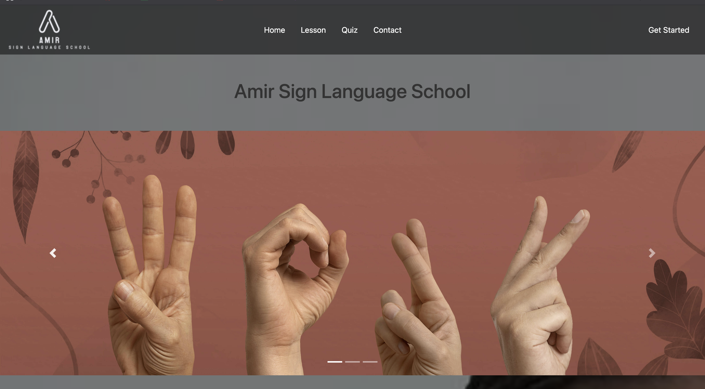

# Amir Sign Language School

A comprehensive **Python Flask** web application for learning American Sign Language (ASL) through interactive lessons, real-time hand gesture recognition, and quizzes.

## 🖼️ Project Preview



## 🎥 Demo Video

[View Demo Video](home.mp4) (27.4 MB)

*Click the link above to download and watch the demo video*

## 🚀 Features

- **Real-time Hand Gesture Recognition**: Uses MediaPipe and OpenCV to detect and interpret hand signs
- **Interactive Lessons**: Learn ASL alphabet and common phrases with visual guides
- **Live Camera Integration**: Practice signs with real-time feedback
- **Quiz System**: Test your knowledge with interactive quizzes
- **Responsive Design**: Modern, user-friendly interface that works on all devices
- **Dark Mode Support**: Beautiful dark theme for better user experience

## 🛠️ Technologies Used

- **Backend**: **Python Flask** (Main Framework)
- **Computer Vision**: OpenCV, MediaPipe
- **Data Processing**: Pandas, NumPy
- **Frontend**: HTML, CSS, JavaScript
- **Machine Learning**: TensorFlow Lite (via MediaPipe)


## 📚 How to Use

### Learning Mode
1. Navigate to the **Lesson** section
2. Allow camera access when prompted
3. Show hand gestures to the camera
4. The system will recognize and display the corresponding ASL letter/phrase

### Quiz Mode
1. Go to the **Quiz** section
2. Choose your difficulty level
3. Answer questions about ASL signs
4. Track your progress and scores

## 🏗️ Project Structure

```
amir-sign-language-school/
├── app.py                 # Main Flask application (Python)
├── templates/            # HTML templates
│   ├── base.html         # Base template
│   ├── index.html        # Homepage
│   ├── lesson.html       # Lesson page
│   ├── quiz.html         # Quiz page
│   └── about.html        # About page
├── static/               # Static files
│   ├── css/             # Stylesheets
│   ├── img/             # Images and assets
│   └── quiz/            # Quiz resources
├── requirements.txt      # Python dependencies
└── README.md            # This file
```

## 🔧 Configuration

The application can be configured through environment variables:

- `FLASK_ENV`: Set to 'development' for debug mode
- `FLASK_DEBUG`: Enable/disable debug mode

## 📱 Supported ASL Signs

The application currently supports:
- **Alphabet**: A-Z (excluding J and Z which require motion)
- **Numbers**: 0-9
- **Common Phrases**: Hello, Thank you, Love, etc.


## 👨‍💻 Author

**Mohamed Hassan Jibril**
- **GitHub:** [mjibreel](https://github.com/mjibreel)
- **LinkedIn:** [moh-jibril](https://www.linkedin.com/in/moh-jibril)

